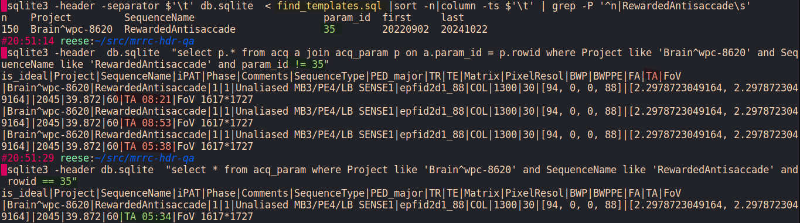

.. mrrc-hdr-qa documentation master file, created by
   sphinx-quickstart on Mon Oct 21 19:00:25 2024.
   You can adapt this file completely to your liking, but it should at least
   contain the root `toctree` directive.

mrrc-hdr-qa documentation
=========================

Code to parse dicoms into a template database and alert on non-conforming sequences.

Code
--------

.. toctree::
   :caption: Contents:

.. autosummary::
   :toctree: _autosummary
   :recursive:

   mrqart
   dcmmeta2tsv
   acq2sqlite
   change_header
   template_checker
   compliance_check_html

Overview
--------

Template
++++++++

See :py:data:`acq2sqlite.DBQuery.CONSTS`

Here's an example for the ``RewardedAnti`` task acquisitions in the ``WPC-8620`` project. The ideal template is found finding the most frequent set of repeated key parameters. 150 of the ``RewardedAnti`` seqeuences share the same ``acq_param`` set, here stored in the sqlite db on rowid=35. But 4 acquisitions (rows in ``acq``) don't match. In this case all mismatches can be found in ``TA``.

.. `https://dicom-parser.readthedocs.io/en/latest/siemens/csa_headers.html#csa-headers`_

Parameters
----------

 .. csv-table:: Dicom tag list
    :file: ../docs/taglist.csv
    :header-rows: 1

.. .. include:: ../readme.md
